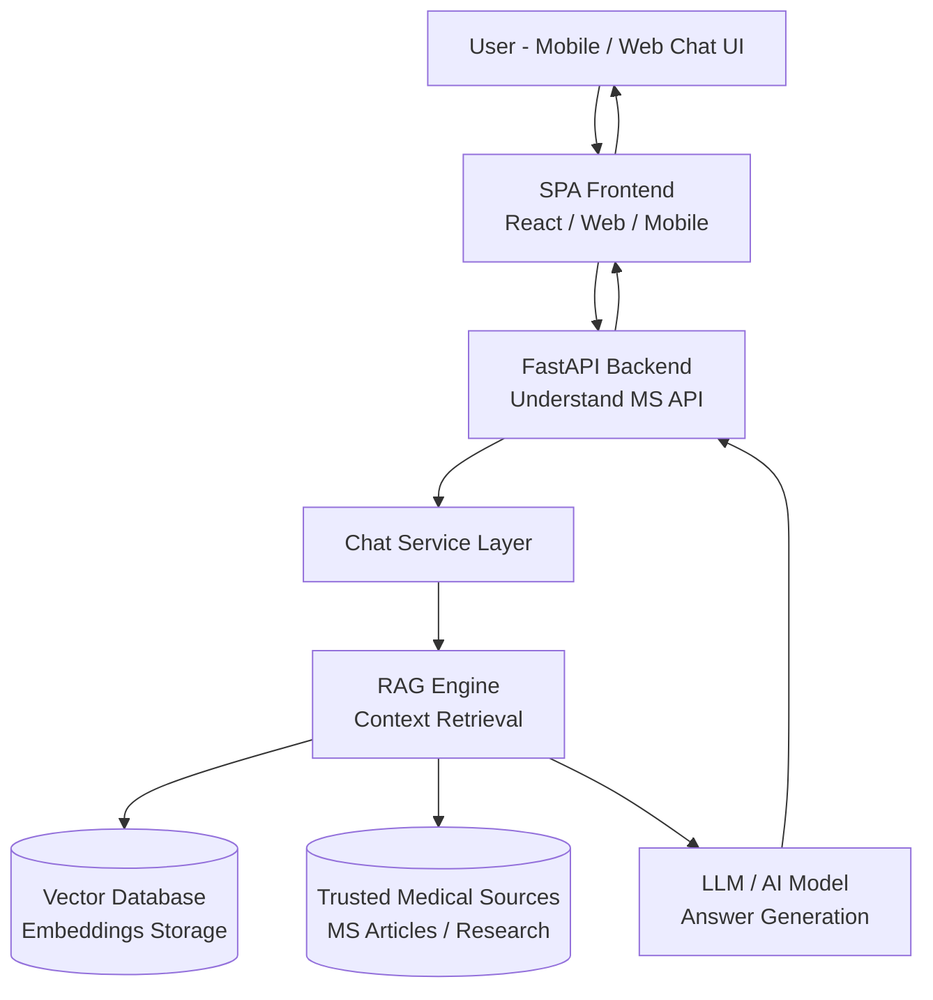

# Architecture Overview

The application follows a **SPA + API architecture**, where the frontend communicates with the backend API that orchestrates the AI logic.



---

# Project Structure

```
understand-ms/

api/
    main.py
    config.py

    routes/
        chat.py

    services/
        chat_service.py

    utils/

tests/

Dockerfile
requirements.txt
README.md

.github/
    workflows/
        build.yml
```

---

# Dependencies

Below are the main dependencies used in this project.

---

## FastAPI

FastAPI is the core framework used to build the REST API.

Features:

* high performance
* asynchronous support
* automatic API documentation
* request validation with Pydantic

Why it is used:

FastAPI is ideal for AI APIs because it handles **async I/O efficiently**, which is important when interacting with external services such as LLM providers.

---

## Uvicorn

Uvicorn is an **ASGI server** used to run the FastAPI application.

Responsibilities:

* running the Python web server
* handling HTTP requests
* managing async execution

Example command:

```
uvicorn api.main:app --reload
```

---

## Pydantic

Pydantic provides **data validation and serialization**.

It is used for:

* validating API request bodies
* defining response models
* ensuring type safety

Example:

```python
class ChatRequest(BaseModel):
    question: str
```

This guarantees the API receives structured data.

---

## Python-dotenv

Python-dotenv loads environment variables from a `.env` file.

Purpose:

* manage configuration
* store secrets locally
* keep credentials out of code

Example variables:

```
OPENAI_API_KEY=
VECTOR_DB_URL=
```

---
